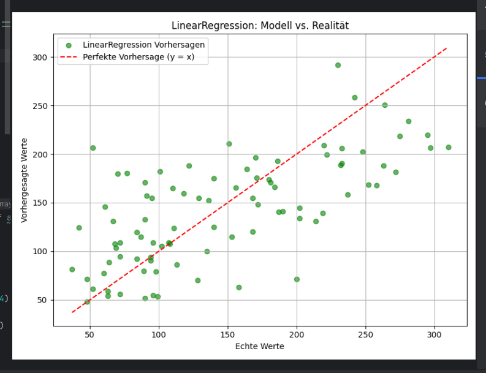

# Diabetes Prediction – Vergleich von drei ML-Ansätzen

Dieses Projekt zeigt drei verschiedene Methoden zur Vorhersage von Diabeteswerten anhand des `load_diabetes()` Datensatzes aus `sklearn.datasets`.

## 🔍 Ziel

Vergleich der Vorhersagegenauigkeit (MSE) von:
- LinearRegression (klassisch, erklärbar)
- RandomForestRegressor (robust, nicht-linear)
- PyTorch (einfaches neuronales Netz)

## 📂 Dateien

- `LinearRegression.py` – Modell mit `sklearn.linear_model.LinearRegression`
- `RandomForestRegressor.py` – Modell mit `sklearn.ensemble.RandomForestRegressor`
- `PyTorch.py` – Modell mit einem einfachen neuronalen Netz in PyTorch

## 📊 Ergebnisse (Test-MSE)

| Modell                 | Test-MSE   |
|------------------------|------------|
| LinearRegression       | 2900.19    |
| RandomForestRegressor  | 2963.01    |
| PyTorch                | 4960.96    |

- Hinweis: Das PyTorch-Modell ist einfach gehalten und noch kein neuronales Meisterwerk – aber ein Einstieg in Deep Learning.

### Aber: Was spricht gegen PyTorch in diesem Fall?

- Der `load_diabetes()` Datensatz ist relativ klein (nur 442 Samples).
- Deep Learning braucht viel mehr Daten, um seine Stärken auszuspielen.
- RandomForest und LinearRegression sind bei kleinen Datensätzen oft effizienter und stabiler.

## 🛠️ Verwendete Technologien

- Python 3.8  
- PyTorch (`torch`)  
- matplotlib (`matplotlib.pyplot`)  
- scikit-learn (`sklearn.datasets`, `LinearRegression`, `RandomForestRegressor`)  
- PyCharm – Entwicklungsumgebung  
- Diabetes Dataset aus `sklearn`

## 🧪 Besonderheiten

- `random_state=42` – weil 42 bekanntlich die Antwort auf alles ist 😉
- Daten wurden skaliert mit `StandardScaler`
- Train/Test Split: 80% Training, 20% Test

## 📷 Beispiel-Visualisierung

## 👩‍💻 Autor

Erstellt von Serena – mit viel Lernfreude 😄

## 📄 Lizenz

Dieses Projekt kann frei verwendet und angepasst werden – für Lernzwecke, Spaß und persönliche Weiterentwicklung.

